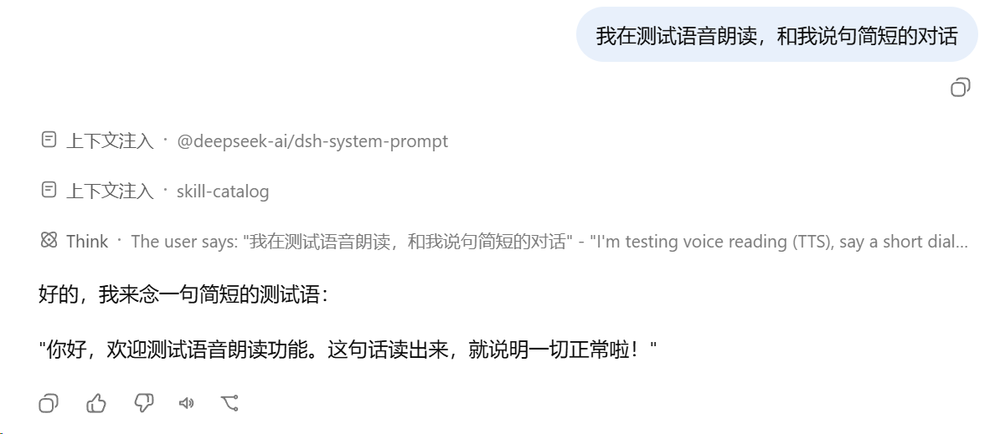
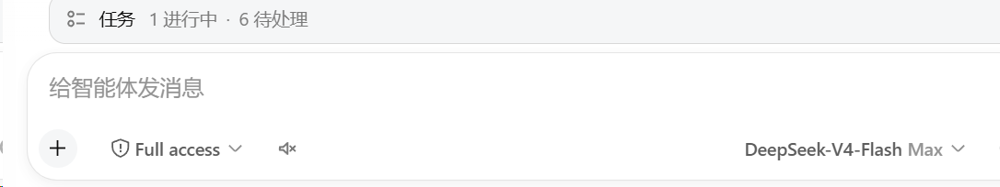
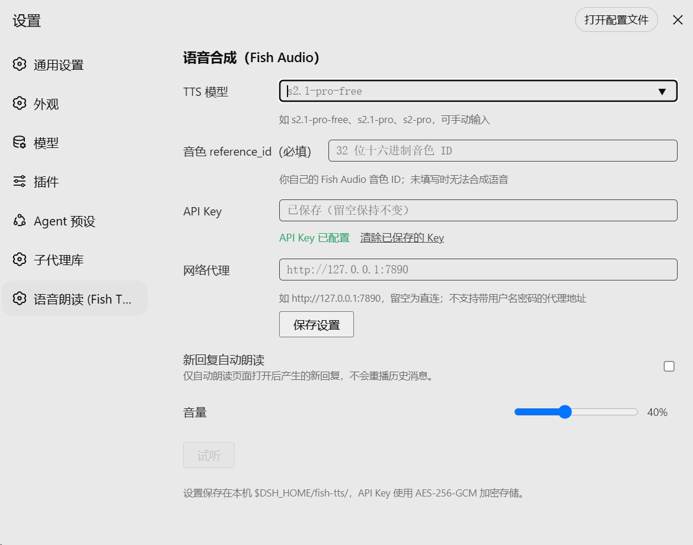

# dsh-fish-tts

**English | [中文](./README.md)**

<p align="center">
  
</p>

<p align="center">
  
  
  
</p>

A third-party **text-to-speech (TTS) plugin** for the
[DeepSeek Harness](https://github.com/deepseek-ai/deepseek-harness) (DSH) Web GUI:
one-click **read-aloud** for every assistant reply, an **auto-read** toggle in the
composer, and configurable model / voice / encrypted API key / proxy. **Fish Audio
API only — bring your own API key.** Works with any voice id (`reference_id`) you
are authorized to use, including voices you **cloned** on Fish Audio. The UI is
bilingual (English / 中文, follows the DSH locale).

### 30-second comparison vs. typical Edge TTS plugins

| | dsh-fish-tts (this plugin) | typical Edge TTS plugins |
| --- | --- | --- |
| Engine | **Fish Audio official API** (only; bring your own key) | Microsoft Edge built-in voices |
| Voice | Your own `reference_id` (incl. voices you cloned, must be authorized) | Fixed Edge voice library |
| API key | **Required** (AES-256-GCM encrypted in the settings page) | None |
| Best for | Users with a Fish Audio account who want their own or cloned voices | Quick free trials with fixed voices |

## Features

- **Read-aloud action**: every finalized assistant message gets a speaker button in its
  action strip (same icon style as the native actions). Click to synthesize and play that
  reply; **click the same message's button again while playing to stop** (no restart from
  the top), clicking another message's button switches playback straight over, and a
  second click while synthesis is still in flight cancels it. Markdown is
  cleaned before speaking: paths, URLs, long ids and code blocks are
  replaced with placeholders instead of being read out.
- **Auto-read**: a small speaker toggle in the composer tool row (synced with the settings
  page). When enabled, replies that arrive after the page loaded are read automatically.
- **Settings page** (Settings → Voice (Fish TTS)):
  - TTS model (datalist suggestions + free text; e.g. s2.1-pro-free / s2.1-pro / s2-pro;
    saved values apply immediately; default s2.1-pro-free)
  - Voice `reference_id` (**required** — voices are personal data, the plugin ships no
    default; synthesis is refused with a hint while empty)
  - API key (**AES-256-GCM encrypted** in `$DSH_HOME/fish-tts/settings.json` on this
    machine; `key.bin` is generated once and ACL-tightened on Windows; the key never
    appears in any GET response, log line or the repository)
  - HTTP proxy (e.g. `http://127.0.0.1:7890`, leave empty for direct)
  - Test clip, auto-read toggle, volume slider (default 60%), playback-speed slider
    (0.5–2.0×, pitch-preserving; fixed at 1× where the browser lacks support)

## Screenshots

<p align="center">
  <br>
  <em>The "Read aloud" button in the message action strip</em>
</p>

<p align="center">
  <br>
  <em>The auto-read toggle in the composer tool row</em>
</p>

<p align="center">
  <br>
  <em>Settings page: model / voice / API key / proxy / test</em>
</p>

## Install

One command, from npm (recommended):

```sh
npx @deepseek-ai/dsh plugin --profile web add dsh-fish-tts
```

Then **restart `dsh web`** (stop the process, run `dsh web` again), refresh the page, and open **Settings → Voice (Fish TTS)**.

Other install sources:

```sh
# From GitHub (git-hosted plugins build on install)
npx @deepseek-ai/dsh plugin --profile web add github:MaRi23333/dsh-fish-tts

# From a local checkout
git clone https://github.com/MaRi23333/dsh-fish-tts.git
cd dsh-fish-tts
pnpm install && pnpm run build
npx @deepseek-ai/dsh plugin --profile web add /absolute/path/to/dsh-fish-tts
```

> The repo commits `lib/` build artifacts, so git installs need no local build; after
> changing sources run `pnpm run build` and restart.

> **Switching from the GitHub install to npm:** a bare `add dsh-fish-tts` is a silent
> no-op when the git version is already installed (pnpm considers the same-name
> dependency satisfied). Use `npx @deepseek-ai/dsh plugin --profile web add dsh-fish-tts@latest`
> instead, or `remove` first and then `add`.

> When installing a freshly published npm version, pnpm's supply-chain protection may
> automatically add `minimumReleaseAgeExclude: [dsh-fish-tts@…]` to the profile's
> `pnpm-workspace.yaml`. This is expected and harmless.

### Verify the install

1. Open **Settings → Voice (Fish TTS)**;
2. Fill in your **API key** and voice **`reference_id`**;
3. Click **Save settings** (the API key status turns "configured");
4. Click **Test** — hearing the test sentence in your voice means the install works.

> The **Test** button performs one real synthesis and verifies the key, the voice and
> the proxy configuration in a single click. It stays disabled while the settings are
> unsaved or the voice is empty.

## Configuration

First run: open Settings → Voice (Fish TTS), fill in model, voice, API key (from Fish
Audio) and a proxy if needed, save, then use the **Test** button. All settings take
effect immediately after saving — no restart required.

You may also add a `config` to the `fish-tts` row in your profile's `cordis.patch.yml`
(settings-page values take precedence):

```yaml
- id: fish-tts
  config:
    model: s2.1-pro-free
    format: wav
    stateDir: /custom/state/dir
```

### Config keys

| Key | Default | Description |
| --- | --- | --- |
| `model` | `''` | Default model (settings-page value wins) |
| `voice` | `''` | Default voice reference_id (settings-page value wins) |
| `format` | `wav` | `wav` / `mp3` / `opus` / `pcm` |
| `apiKey` | `''` | Usually empty; the encrypted settings-page key wins, then env `FISH_API_KEY` |
| `apiKeyFile` | `''` | Read `FISH_API_KEY` from a dotenv file |
| `proxy` | `''` | HTTP(S) proxy (settings-page value wins) |
| `stateDir` | `$DSH_HOME/fish-tts` | Settings / key-file directory |

## Security

- The API key is persisted only in encrypted form (AES-256-GCM, per-machine random
  `key.bin`, 0600/ACL tightened) and never written to the repo, logs or any GET response.
- Write routes (synthesize/config) require `application/json` and validate
  same-origin/loopback `Origin`, blocking cross-site form abuse.
- **Local-only**: every `/fish-tts/*` route rejects non-loopback peers
  (127.0.0.1 / ::1 / ::ffff:127.0.0.1) with 403, even if the host listens on 0.0.0.0.
- **Proxy URLs with username/password are refused** on save; credentialed
  `HTTPS_PROXY`/`HTTP_PROXY` env vars are likewise ignored (no leak, no fallback) —
  use a credential-less proxy or direct connection.
- Proxy addresses, models and voices are machine-local user settings; the repo carries
  no personal data.
- Synthesis text is capped at 12000 characters; results are cached in-process
  (max 200 entries), cleared on restart.

## Develop

```sh
pnpm install
pnpm run typecheck
pnpm run test       # node:test suite (upstream Fish API is locally mocked, no network)
pnpm run build      # host: lib/index.js; client: lib/client.js (ModuleLoader CJS closure)
pnpm run smoke      # host entry + client ModuleLoader smoke tests
pnpm run check:pack # npm pack content whitelist check
```

> Requires Node >= 22 (Node 20 is EOL). CI (`.github/workflows/ci.yml`) runs the full
> gate chain on Node 22 and 24 and verifies `lib/` artifacts match the committed ones.

- Host side lives in `src/index.ts` (Node; registers the `/fish-tts/*` routes and the
  settings store).
- Client side lives in `src/client/` (React; registers the
  `conversation.chat.assistant-actions`, `conversation.input.left` and
  `settings.section` slots).
- Built against the DSH `0.1.0-rc.6` runtime API and verified working on `0.1.1-rc.1`
  (no API drift); if the API drifts on other versions, align
  with the matching tag of the [deepseek-harness repo](https://github.com/deepseek-ai/deepseek-harness).

## License

[MIT](./LICENSE)

### Compliance & Third-Party Notice

- This is a **third-party open-source plugin**, not affiliated with, sponsored, or endorsed by Fish Audio / Hanabi AI Inc. "Fish Audio" is a trademark of its owner and is used here descriptively only.
- The plugin **does not distribute or host API keys** — use your own Fish Audio account and key, and keep it safe.
- Fish Audio's **free tier is for personal, non-commercial use only**; commercial use requires a paid plan. See the [Terms of Use](https://fish.audio/terms).
- Only use voices (reference_id) you are authorized to use. Do not clone or imitate the voice of public figures, celebrities, or private individuals without permission. See the [Acceptable Use Policy](https://fishaudio.org/zh/acceptable-use).
- When distributing generated audio, disclose that it is AI-synthesized; do not mislead listeners into believing it is a real human recording.
- Using this plugin means you agree to Fish Audio's terms; the official pages prevail if updated.

---

*Independent community project — not affiliated with or endorsed by DeepSeek.*
